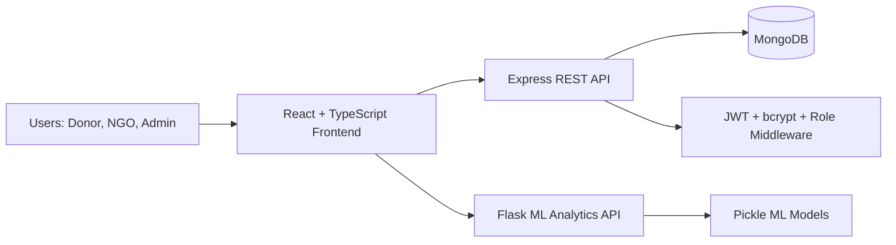
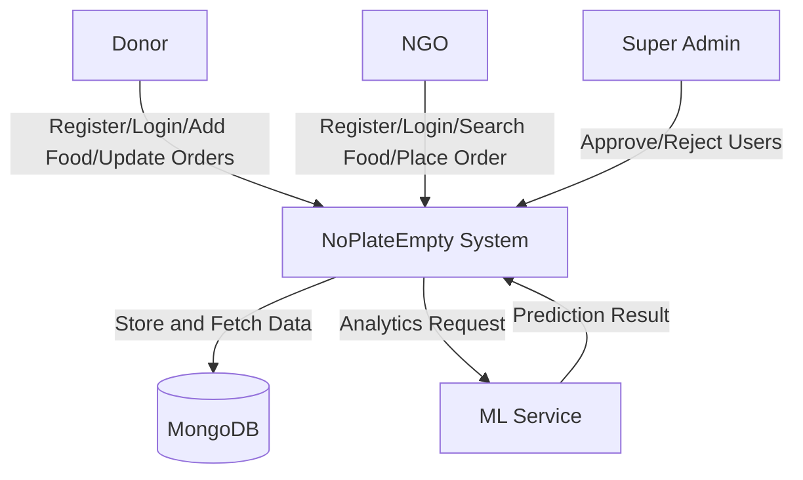
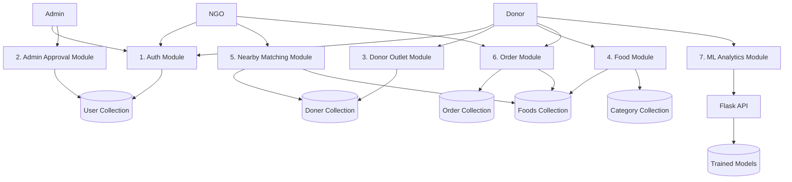
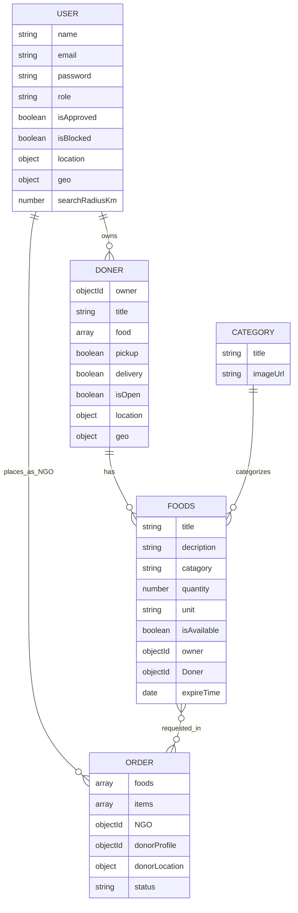

# NoPlateEmpty Project Viva And Presentation Preparation

Use this as your final revision sheet for presentation and viva. It is based on the actual code in this repo:

- Backend: `no-plate-empty-backend`
- Frontend: `no-plate-empty-frontend`
- ML service: `no-plate-empty-backend/app.py` and `no-plate-empty-backend/ml`

## 1. One Minute Project Introduction

NoPlateEmpty is a food donation and redistribution platform. The main goal is to reduce food wastage by connecting food donors with NGOs/recipients who can collect and distribute surplus food. The system has three main roles: Super Admin, Donor, and NGO. Donors can create outlets and upload available food with quantity, expiry time, and pickup location. NGOs can browse nearby available food, place orders, and track request status. Super Admin approves or rejects donor and NGO registrations. The project also includes an ML analytics service that predicts food demand, recommends cooking quantity, and estimates surplus risk.

## 2. Problem Statement

Many hotels, hostels, restaurants, canteens, and event places have leftover food, while NGOs and needy people struggle to access food on time. Manual coordination is slow and unreliable. Our project solves this by creating a digital bridge between donors and NGOs with authentication, approval, food listing, nearby matching, order tracking, and demand prediction.

## 3. Objectives

- Reduce food wastage by making surplus food visible to NGOs.
- Help NGOs find nearby donors using location and search radius.
- Give donors a dashboard to manage outlets, food items, and incoming orders.
- Give admins control over user approvals for safety and trust.
- Use ML to estimate demand and surplus risk for better food planning.
- Provide a clean web interface for donors, NGOs, and admins.

## 4. Tech Stack Used

| Layer | Technology | Why Used |
|---|---|---|
| Frontend | React 18 | Component-based UI |
| Frontend Language | TypeScript | Type safety and maintainability |
| Build Tool | Vite | Fast dev server and build |
| Styling | Tailwind CSS | Utility-first responsive design |
| UI Components | shadcn/ui, Radix UI | Reusable accessible components |
| Routing | React Router DOM | Page navigation and protected routes |
| State/Auth | React Context, localStorage | Store session and logged-in user |
| Backend | Node.js, Express.js | REST API server |
| Database | MongoDB | Flexible document database |
| ODM | Mongoose | Schemas, validation, refs, indexes |
| Authentication | JWT | Token-based stateless authentication |
| Password Security | bcrypt | Password hashing |
| Config/Security | cors, dotenv | Cross-origin control and environment variables |
| ML Backend | Python Flask | Separate ML analytics API |
| ML Libraries | pandas, scikit-learn | Dataset processing and model training |
| ML Models | Linear Regression, Decision Tree Classifier | Demand prediction and surplus risk |

## 5. Project Architecture

Short explanation:

- React frontend handles pages, dashboards, forms, and protected navigation.
- Express backend handles authentication, authorization, CRUD APIs, orders, and matching.
- MongoDB stores users, donor outlets, foods, categories, orders, and revoked tokens.
- Flask ML service predicts demand and surplus risk.

## 6. User Roles

| Role | Main Work |
|---|---|
| SUPER_ADMIN | Login, view pending users, approve/reject registrations |
| DONOR | Create donor outlet, add food, manage categories, view orders, update order status, use analytics |
| NGO | Add location, view nearby donors/foods, place orders, view order history |

## 7. Team Work Division For 4 Members

Replace names with your actual team member names.

| Member | Responsibility | Modules/Files To Explain |
|---|---|---|
| Member 1: You | Backend lead and frontend integration help | Express app, routes, controllers, models, auth, JWT, MongoDB, API connection, location matching, order flow |
| Member 2 | Frontend UI design and landing/auth pages | Landing page, login/admin login UI, register flow, common components, Tailwind/shadcn design |
| Member 3 | Frontend dashboard and API integration | Donor dashboard, NGO dashboard, food/order UI, protected routes, AuthContext, frontend API helpers |
| Member 4 | ML module | Flask API, dataset, model training, demand prediction, surplus risk, analytics integration |

### Presentation Speaking Flow

| Time | Speaker | Topic |
|---|---|---|
| 1 min | Member 1 | Problem statement, project overview, architecture |
| 2 min | Member 2 | Frontend design, pages, user experience |
| 2 min | Member 3 | Donor/NGO dashboard workflow, API integration |
| 2 min | Member 1 | Backend routes, database, auth, order flow, location matching |
| 2 min | Member 4 | ML model, dataset, analytics output |
| 1 min | Any member | Limitations, future scope, conclusion |

## 8. SRS Summary

### Purpose

The purpose of NoPlateEmpty is to provide a web-based food donation platform where donors can post surplus food and NGOs can request food based on availability and location.

### Scope

The system supports registration, login, admin approval, donor outlet creation, food listing, location-based nearby matching, order placement, order status tracking, and ML-based demand analytics.

### Functional Requirements

| ID | Requirement |
|---|---|
| FR1 | Users can register as DONOR or NGO. |
| FR2 | Super Admin can approve or reject pending users. |
| FR3 | Users can log in only after approval. |
| FR4 | JWT token is used to access protected APIs. |
| FR5 | Donor can create and manage donor outlets. |
| FR6 | Donor can add, update, and delete food items. |
| FR7 | Donor can manage food categories. |
| FR8 | NGO can save location and search radius. |
| FR9 | NGO can view nearby donor outlets and foods. |
| FR10 | NGO can place an order for available food. |
| FR11 | Donor can view incoming orders. |
| FR12 | Donor can accept, reject, or complete orders based on valid transitions. |
| FR13 | Quantity reduces when an order is accepted. |
| FR14 | User can update account details, reset password, logout, or delete account. |
| FR15 | Donor can view ML-based performance analytics. |

### Non-Functional Requirements

| Type | Requirement |
|---|---|
| Security | Passwords are hashed, APIs are protected by JWT, role-based access control is used. |
| Performance | Nearby donor search uses MongoDB geo index when coordinates exist. |
| Usability | Separate dashboards exist for admin, donor, and NGO. |
| Maintainability | Project is divided into routes, controllers, models, utilities, and frontend components. |
| Reliability | Frontend handles API errors and ML service fallback. |
| Scalability | MongoDB document model and modular API routes can support more users and features. |

### Hardware/Software Requirements

- Node.js and npm for backend/frontend.
- Python environment for Flask ML service.
- MongoDB database.
- Browser for using the React application.
- Environment variables like `MONGO_URI`, `JWT_SECRET`, `PORT`, `VITE_API_BASE_URL`, and optionally `VITE_ML_API_BASE_URL`.

## 9. DFD Level 0

## 10. DFD Level 1

## 11. ER Diagram

Note for viva: In code, some names are legacy spellings like `Doner`, `catagory`, and `decription`. We kept them because changing field names after database/API integration can break existing data and frontend contracts. Future improvement is to migrate them to `Donor`, `category`, and `description`.

Also note: Category is shown as a logical relationship in the ER diagram. In the current MongoDB model, `FoodModel` stores category in the string field `catagory`, not as an ObjectId reference to `Category`.

## 12. Important Files

### Backend

| File | Purpose |
|---|---|
| `app.js` | Creates Express app, JSON parser, CORS, auth routes, admin routes, production frontend serving |
| `server.js` | Connects DB, runs geo backfill, mounts category/donor/food routes, starts server |
| `controllers/auth.controller.js` | Register, login, current user, profile update, reset password, logout, delete account |
| `controllers/admin.controller.js` | Pending user list, approve user, reject user |
| `controllers/DonerController.js` | Donor outlet CRUD and nearby outlet lookup |
| `controllers/foodController.js` | Food CRUD, nearby foods, order placement, order status updates |
| `middleware/auth.middleware.js` | Verifies JWT and checks revoked tokens |
| `middleware/role.middleware.js` | Allows only selected roles |
| `utils/ngoMatching.js` | Geo and fallback location matching |
| `utils/location.js` | Normalizes location and builds GeoJSON points |

### Frontend

| File | Purpose |
|---|---|
| `src/App.tsx` | Main routes and role-protected pages |
| `src/context/AuthContext.tsx` | Login, logout, session hydration, current user sync |
| `src/routes/ProtectedRoute.tsx` | Blocks unauthenticated users and checks roles |
| `src/routes/PublicRoute.tsx` | Redirects logged-in users away from login pages |
| `src/lib/api.ts` | API and ML API base URLs |
| `src/lib/auth.ts` | Token storage, auth headers, current user fetch, error messages |
| `src/lib/feature-api.ts` | API functions for categories, donors, foods, orders, ML analytics |
| `src/pages/DonorDashboard.tsx` | Donor workspace tabs |
| `src/pages/NgoDashboard.tsx` | NGO workspace tabs |
| `src/pages/admin/AdminDashboard.tsx` | Admin pending approvals |

### ML

| File | Purpose |
|---|---|
| `app.py` | Flask app with `/health` and `/analytics` endpoints |
| `ml/train_model.py` | Trains demand and surplus models |
| `ml/predict.py` | Loads pickle models and returns predictions |
| `ml/model_metadata.json` | Stores feature columns and category mappings |
| `data/meal_data.csv` | Dataset with date, hostel, meal type, menu, attendance, cooked quantity, leftover quantity |

## 13. API Endpoint Cheat Sheet

### Auth APIs

| Method | Endpoint | Purpose |
|---|---|---|
| POST | `/api/auth/register` | Register user |
| POST | `/api/auth/login` | Login and get JWT |
| GET | `/api/auth/me` | Get logged-in user |
| PATCH | `/api/auth/me` | Update account/location |
| PATCH | `/api/auth/reset-password` | Reset password |
| POST | `/api/auth/logout` | Revoke token |
| DELETE | `/api/auth/me` | Delete account |

### Admin APIs

| Method | Endpoint | Purpose |
|---|---|---|
| GET | `/api/admin/pending-users` | View pending users |
| PATCH | `/api/admin/approve/:id` | Approve user |
| PATCH | `/api/admin/reject/:id` | Reject user |

### Donor Outlet APIs

| Method | Endpoint | Purpose |
|---|---|---|
| POST | `/api/v1/Doner/create` | Create outlet |
| GET | `/api/v1/Doner/me` | Get latest outlet of current donor |
| GET | `/api/v1/Doner/my-records` | Get all outlets of current donor |
| GET | `/api/v1/Doner/nearby` | NGO gets nearby donor outlets |
| GET | `/api/v1/Doner/get-all-Doners` | Get all outlets |
| GET | `/api/v1/Doner/get/:id` | Get one outlet |
| PUT | `/api/v1/Doner/update/:id` | Update outlet |
| DELETE | `/api/v1/Doner/delete/:id` | Delete outlet |

### Food And Order APIs

| Method | Endpoint | Purpose |
|---|---|---|
| POST | `/api/v1/food/create` | Create food |
| GET | `/api/v1/food/get-all-food` | Get all foods |
| GET | `/api/v1/food/nearby` | NGO gets nearby foods |
| GET | `/api/v1/food/get/:id` | Get single food |
| GET | `/api/v1/food/get-by-doner/:donerId` | Get foods by outlet |
| GET | `/api/v1/food/my-foods` | Donor gets own foods |
| PUT | `/api/v1/food/update/:id` | Update food |
| PUT | `/api/v1/food/delete/:id` | Delete food |
| POST | `/api/v1/food/place-order` | NGO places order |
| GET | `/api/v1/food/my-orders` | NGO order history |
| GET | `/api/v1/food/donor-orders` | Donor incoming orders |
| PATCH | `/api/v1/food/order-status/:orderId` | Update order status |

### ML APIs

| Method | Endpoint | Purpose |
|---|---|---|
| GET | `/health` | Check ML service health |
| POST | `/analytics` | Predict demand, cooking quantity, and surplus risk |

## 14. Project Workflow

### Donor Workflow

1. Donor registers.
2. Admin approves donor.
3. Donor logs in.
4. Donor creates outlet with location.
5. Donor adds food with quantity, category, code, expiry time, and outlet.
6. Donor receives orders from NGOs.
7. Donor accepts, rejects, or completes orders.
8. On accept, food quantity is reduced.

### NGO Workflow

1. NGO registers with location and search radius.
2. Admin approves NGO.
3. NGO logs in.
4. NGO views nearby donor outlets and available foods.
5. NGO places an order for foods from one donor outlet at a time.
6. NGO tracks order status.

### Admin Workflow

1. Super Admin logs in.
2. Admin views pending users.
3. Admin approves valid users or rejects invalid users.
4. Approved users can log in.

### ML Workflow

1. Donor enters day, weekday, meal type, menu, and hostel.
2. Frontend sends data to Flask `/analytics`.
3. Flask loads trained models.
4. Linear Regression predicts demand.
5. Recommended cooking is predicted demand plus 10 percent buffer.
6. Decision Tree predicts surplus risk as Low, Medium, or High.

## 15. Common Viva Questions With Answers

### Project Questions

Q1. What is your project?

Answer: NoPlateEmpty is a web-based food donation platform that connects donors with NGOs to reduce food wastage and make surplus food available to people who need it.

Q2. Why did you choose this project?

Answer: Food wastage is a real social problem. Many places have leftover food, but NGOs may not know about it in time. Our system creates a fast digital connection between donors and NGOs.

Q3. Who are the users of your system?

Answer: The main users are Super Admin, Donor, and NGO. Donors donate food, NGOs request food, and Super Admin approves or rejects registrations.

Q4. What is the unique feature of your project?

Answer: Along with food donation management, we added location-based nearby matching and ML-based demand analytics.

Q5. What are the main modules?

Answer: Auth module, admin approval module, donor outlet module, food management module, category module, nearby matching module, order module, account settings module, and ML analytics module.

Q6. What are the limitations?

Answer: Live maps, payment, notification, image upload storage, and real-time chat are not fully implemented. ML prediction depends on available sample data and can improve with larger real datasets.

Q7. What is future scope?

Answer: Add live map tracking, push notifications, donor verification, image upload to cloud storage, real-time order updates, SMS/email alerts, better ML model with larger dataset, and analytics dashboard for admin.

### Tech Stack Questions

Q8. Why did you use MERN stack?

Answer: MERN uses JavaScript for both frontend and backend, which makes development faster. React gives reusable UI components, Node and Express provide REST APIs, and MongoDB gives flexible document storage.

Q9. Why React?

Answer: React helps build dynamic UI using reusable components. It is suitable for dashboards, forms, routing, and state-based rendering.

Q10. Why TypeScript in frontend?

Answer: TypeScript helps catch type errors early and makes API data structures clearer using interfaces like `FoodItem`, `DonorEntry`, and `OrderItem`.

Q11. Why Vite?

Answer: Vite provides a fast development server, quick hot reload, and optimized frontend build.

Q12. Why Tailwind CSS?

Answer: Tailwind helps create responsive UI quickly using utility classes and keeps styling consistent.

Q13. Why Express.js?

Answer: Express is lightweight and flexible for creating REST APIs, middleware, route handling, and JSON request processing.

Q14. Why MongoDB?

Answer: MongoDB stores flexible document data. Our project has nested location objects, user roles, food items, and orders, so document storage fits well.

Q15. Why Mongoose?

Answer: Mongoose provides schemas, validation, relationships using `ref`, timestamps, indexes, and easier database operations.

Q16. Why Flask for ML?

Answer: Flask is lightweight and easy to expose ML models as REST APIs. It connects well with Python ML libraries like pandas and scikit-learn.

Q17. Why JWT?

Answer: JWT allows stateless authentication. After login, the backend returns a token, and protected APIs verify that token.

### Backend Questions

Q18. What happens in `app.js`?

Answer: `app.js` creates the Express app, enables JSON parsing, configures CORS, mounts auth and admin routes, and serves the frontend build in production.

Q19. What happens in `server.js`?

Answer: `server.js` imports the app, connects to MongoDB, runs stored geo backfill, mounts category/donor/food routes, and starts the server.

Q20. How is password stored?

Answer: Passwords are never stored directly. They are hashed using bcrypt before saving to the database.

Q21. How does login work?

Answer: Backend finds the user by email, checks approval/block/rejection status, compares password using bcrypt, then signs a JWT with `userId` and `role`.

Q22. What is inside the JWT?

Answer: The token contains `userId` and `role`. It expires in 15 minutes according to the login controller.

Q23. How are protected routes secured?

Answer: Protected backend routes use `auth.middleware.js`. It checks the Authorization header, verifies JWT, checks revoked token collection, and attaches decoded user data to `req.user`.

Q24. What is token revocation?

Answer: On logout, the token is saved in `RevokedToken` until expiry. If someone tries to reuse that token, middleware rejects it.

Q25. What is role-based access control?

Answer: Role middleware checks if `req.user.role` is allowed. For example, admin routes allow only `SUPER_ADMIN`.

Q26. How are admin routes protected?

Answer: In `admin.routes.js`, `router.use(auth, role("SUPER_ADMIN"))` protects all admin endpoints.

Q27. What is CORS?

Answer: CORS controls which frontend origins can call the backend. In development, the backend allows localhost frontend URLs like `http://localhost:8080`.

Q28. Why use dotenv?

Answer: dotenv loads sensitive config like database URI, JWT secret, and port from `.env` instead of hardcoding them.

Q29. What is the User schema?

Answer: It stores name, email, hashed password, role, approval/block/rejection status, location, geo point, search radius, and timestamps.

Q30. What is `isApproved`?

Answer: It decides whether a donor or NGO can log in. Donor and NGO users must wait for admin approval.

Q31. Why is `geo` field used?

Answer: `geo` stores GeoJSON point coordinates `[longitude, latitude]` so MongoDB can perform nearby search using a `2dsphere` index.

Q32. What is the Doner model?

Answer: It represents donor outlets. It stores owner, title, image, food types, pickup/delivery options, open status, rating, location, and geo point.

Q33. What is the Food model?

Answer: It stores food title, description, category, code, quantity, unit, availability, owner, donor outlet reference, expiry time, and rating.

Q34. What is the Order model?

Answer: It stores ordered food IDs, item quantities, NGO user, donor profile, donor location, and status such as pending, accepted, rejected, or completed.

Q35. Why do you use `populate`?

Answer: Mongoose populate replaces referenced ObjectIds with actual related documents, like food with donor outlet and owner details.

Q36. How does donor outlet creation work?

Answer: Donor sends title and location. Backend validates required fields, normalizes location, attaches owner from JWT, and saves the outlet.

Q37. How do you prevent a donor from editing another donor's outlet?

Answer: `ensureOutletAccess` checks whether the logged-in user owns the outlet or is `SUPER_ADMIN`.

Q38. How does food creation work?

Answer: Donor must provide title, description, category, code, quantity, and outlet. Backend verifies the outlet belongs to the donor, then saves the food.

Q39. Why is quantity validation important?

Answer: Quantity prevents ordering more food than available and helps automatically mark food unavailable when quantity becomes zero.

Q40. How does order placement work?

Answer: NGO sends cart items. Backend validates NGO role, food availability, requested quantity, single donor outlet rule, nearby matching rule, and creates an order.

Q41. Why only one donor outlet per order?

Answer: It simplifies pickup, donor approval, and status tracking. One order belongs to one donor outlet.

Q42. What are valid order transitions?

Answer: `pending` can become `accepted` or `rejected`. `accepted` can become `completed`. `rejected` and `completed` are final states.

Q43. What happens when a donor accepts an order?

Answer: Backend checks stock again, reduces food quantity, marks food unavailable if quantity becomes zero, saves donor location, and updates order status.

Q44. How does nearby matching work?

Answer: If NGO has GPS coordinates, MongoDB `$nearSphere` finds donor outlets within the search radius. If GPS is missing, fallback matching uses pincode, city/state, city, or state.

Q45. Why use fallback matching?

Answer: Not every user may save GPS coordinates. Fallback matching still allows location matching using pincode, city, or state.

Q46. What is Haversine formula used for?

Answer: It calculates approximate distance between two latitude/longitude points and returns distance in kilometers.

Q47. What is geo backfill?

Answer: It updates existing users and donor outlets by generating geo points from saved location data, so old records can support nearby search.

Q48. How is account deletion handled?

Answer: The user must provide password. Backend verifies password, deletes the user, and revokes the current token.

Q49. How is reset password handled?

Answer: User provides current password and new password. Backend compares current password with bcrypt and saves a bcrypt hash of the new password.

Q50. What status codes do you use?

Answer: Common codes are 200 for success, 201 for created, 400 for bad request, 401 for unauthorized, 403 for forbidden, 404 for not found, 410 for expired rejected registration, and 500 for server error.

### Frontend Questions

Q51. What is `App.tsx` responsible for?

Answer: It defines the application routes, wraps the app with providers, and uses protected routes for admin, donor, and NGO dashboards.

Q52. What is `AuthContext`?

Answer: It manages user authentication state, token, login, logout, session hydration, and current user refresh.

Q53. How is session stored?

Answer: The frontend stores JWT token in localStorage under `token` and user details under `auth_user`.

Q54. What is `ProtectedRoute`?

Answer: It checks if the user is logged in and optionally checks allowed roles. If not valid, it redirects to login or correct dashboard.

Q55. What is `PublicRoute`?

Answer: It prevents logged-in users from visiting login pages again and redirects them to their role-based dashboard.

Q56. How does frontend know API URL?

Answer: `src/lib/api.ts` reads `VITE_API_BASE_URL` and `VITE_ML_API_BASE_URL` from environment variables.

Q57. What is `feature-api.ts`?

Answer: It contains reusable frontend functions for API calls like get categories, create food, place order, get nearby foods, and get ML analytics.

Q58. What happens after login?

Answer: Frontend sends email/password to backend, stores token, fetches `/api/auth/me`, saves user, then redirects based on role.

Q59. What pages does the donor dashboard have?

Answer: Donor dashboard has Outlets, Categories, Foods, Incoming Orders, and Performance Analytics tabs.

Q60. What pages does the NGO dashboard have?

Answer: NGO dashboard has Available Food, Outlet Directory, and My Orders tabs.

Q61. What does admin dashboard show?

Answer: It shows pending users and gives approve/reject actions.

Q62. How are API errors shown?

Answer: Frontend helper functions read API responses, normalize error messages, and dashboard components display error/success states.

Q63. How does frontend handle ML service failure?

Answer: If `/analytics` fails, frontend logs a warning and uses a local forecast fallback so the UI still works.

### ML Questions

Q64. What is the ML part of your project?

Answer: The ML module predicts food demand, recommends cooking quantity, and predicts surplus risk based on day, weekday, meal type, menu, and hostel.

Q65. Which dataset is used?

Answer: The dataset is `meal_data.csv`, which contains date, hostel, meal type, menu, attendance, cooked quantity, and leftover quantity.

Q66. What are the input features?

Answer: The input features are day, weekday, meal_type, menu, and hostel.

Q67. What are the outputs?

Answer: Outputs are predicted demand, recommended cooking quantity, and surplus risk as Low, Medium, or High.

Q68. Which algorithm predicts demand?

Answer: Linear Regression predicts demand using attendance as the target.

Q69. Which algorithm predicts surplus risk?

Answer: Decision Tree Classifier predicts surplus risk based on leftover quantity labels.

Q70. Why Linear Regression?

Answer: Demand is a numeric continuous value, so Linear Regression is a simple and explainable model for prediction.

Q71. Why Decision Tree?

Answer: Surplus risk is a category: Low, Medium, or High. A Decision Tree is easy to understand and suitable for classification.

Q72. How is recommended cooking calculated?

Answer: It adds a 10 percent buffer to predicted demand: recommended cooking equals predicted demand plus 10 percent.

Q73. How are categorical values handled?

Answer: Category mappings in `model_metadata.json` convert values like meal type, menu, and hostel into numeric values.

Q74. How does Flask API work?

Answer: The `/analytics` endpoint accepts JSON input, validates required fields, calls prediction functions, and returns JSON output.

Q75. What is pickle used for?

Answer: Pickle stores trained ML models as `.pkl` files so they can be loaded later for prediction.

Q76. What can improve ML accuracy?

Answer: More real data, more features like event days/weather/season, model evaluation, hyperparameter tuning, and retraining on updated data.

### Database Questions

Q77. What collections are used?

Answer: Main collections are users, doners, foods, orders, categories, revokedtokens, and possibly refresh tokens.

Q78. What is ObjectId reference?

Answer: It links one document to another. For example, food has `owner` referencing User and `Doner` referencing donor outlet.

Q79. Why timestamps?

Answer: Timestamps automatically store `createdAt` and `updatedAt`, useful for sorting latest records and audit tracking.

Q80. What is 2dsphere index?

Answer: It is a MongoDB geospatial index used to query nearby points on Earth.

Q81. Why MongoDB instead of SQL?

Answer: MongoDB handles flexible and nested data well, like location objects and mixed food/order structures. It is also easy to integrate with Node.js using Mongoose.

Q82. What are schema validations?

Answer: Mongoose validates fields like required title, valid role enum, quantity minimum, rating range, latitude/longitude range, and order status enum.

Q83. Why do you store donor location in order?

Answer: Order stores `donorLocation` snapshot so pickup location remains available even if outlet data changes later.

### Security Questions

Q84. How do you secure passwords?

Answer: Passwords are hashed with bcrypt before storing, and login compares the hash using bcrypt.

Q85. How do you secure APIs?

Answer: Protected APIs require JWT in the Authorization header. Middleware verifies the token.

Q86. How do you secure admin APIs?

Answer: Admin APIs require both valid JWT and `SUPER_ADMIN` role.

Q87. What happens if token is invalid?

Answer: Backend returns 401 with an invalid token message, and frontend clears or redirects the session.

Q88. Why do you use environment variables?

Answer: To keep secrets like `JWT_SECRET` and database URI outside code.

Q89. What is the difference between authentication and authorization?

Answer: Authentication checks who the user is. Authorization checks what that user is allowed to do.

Q90. How do you prevent unauthorized food update?

Answer: Backend checks whether the food belongs to the logged-in donor's outlet or if the user is admin.

Q91. How do you prevent invalid orders?

Answer: Backend checks role, food availability, quantity, same donor outlet, and NGO location match before creating an order.

### Code Related Questions

Q92. Explain the login API code.

Answer: It takes email and password, finds user, checks rejection/approval/block status, compares hashed password, signs JWT with userId and role, and returns token and role.

Q93. Explain auth middleware.

Answer: It reads Bearer token from Authorization header, checks revoked token collection, verifies JWT, saves decoded payload in `req.user`, and calls `next()`.

Q94. Explain role middleware.

Answer: It receives allowed roles and checks whether `req.user.role` is included. If not, it returns access denied.

Q95. Explain `mapFoodPayload`.

Answer: It maps frontend request fields to backend model fields. It supports both correct and legacy names like `description` to `decription` and `category` to `catagory`.

Q96. Explain `normalizeLocationInput`.

Answer: It trims strings, converts numeric values, removes undefined fields, and returns a clean location object.

Q97. Explain `buildGeoPointFromLocation`.

Answer: It checks latitude and longitude validity and returns a GeoJSON Point with coordinates in `[longitude, latitude]` order.

Q98. Why coordinates are `[longitude, latitude]` and not `[latitude, longitude]`?

Answer: GeoJSON and MongoDB geospatial queries expect coordinates in `[longitude, latitude]` order.

Q99. Explain nearby foods API.

Answer: It verifies NGO role, gets NGO location, finds matching donor outlets, fetches available foods from those outlets, adds distance/match mode, and sorts results.

Q100. Explain order status update API.

Answer: It checks donor/admin role, verifies order exists, checks ownership, validates transition, reduces quantity when accepted, saves donor pickup location, and returns updated order.

Q101. Explain frontend `apiRequest`.

Answer: It builds headers, attaches token if available, sends fetch request, parses response, throws errors for failed responses, and returns typed payload.

Q102. Explain `getDonorPerformanceAnalytics`.

Answer: It sends analytics input to ML API. If the ML service is unavailable, it returns a local fallback prediction.

Q103. What is the most important backend logic?

Answer: The most important backend logic is secure auth, admin approval, ownership checks, nearby matching, order validation, and stock update on accepted orders.

Q104. What is the most important frontend logic?

Answer: AuthContext, protected routing, API helpers, dashboard tabs, and user-role-based navigation.

Q105. What is the most important ML logic?

Answer: Training demand/surplus models, loading pickle models, preprocessing input, and returning analytics predictions from Flask.

### DFD/SRS Questions

Q106. What is SRS?

Answer: SRS means Software Requirements Specification. It describes what the system should do, who will use it, functional requirements, non-functional requirements, constraints, and interfaces.

Q107. What are functional requirements?

Answer: Functional requirements describe features like registration, login, admin approval, food CRUD, order placement, nearby search, and analytics.

Q108. What are non-functional requirements?

Answer: Non-functional requirements describe quality attributes like security, performance, usability, maintainability, reliability, and scalability.

Q109. What is DFD?

Answer: DFD means Data Flow Diagram. It shows how data moves between users, processes, and data stores.

Q110. What is Level 0 DFD?

Answer: Level 0 DFD is a context diagram showing the entire system as one process connected to external entities like Donor, NGO, Admin, Database, and ML service.

Q111. What is Level 1 DFD?

Answer: Level 1 DFD breaks the system into modules like auth, admin approval, donor outlet, food, matching, order, and analytics modules.

Q112. What is ER diagram?

Answer: ER diagram shows entities and relationships, like User owns Doner outlets, Doner has Foods, NGO places Orders, and Order contains Foods.

### Testing And Deployment Questions

Q113. How did you test backend APIs?

Answer: We used API testing through Postman collection and manual frontend testing. The backend also has Postman documentation in `docs/postman`.

Q114. How did you test frontend?

Answer: We tested user flows manually: registration, login, admin approval, donor food creation, NGO order placement, and order status updates.

Q115. How can you improve testing?

Answer: Add automated unit tests for controllers and utilities, integration tests for APIs, and frontend component tests.

Q116. How can this project be deployed?

Answer: Frontend can be built using Vite, backend can serve the built frontend in production, MongoDB can be hosted using MongoDB Atlas, and Flask ML can run as a separate service.

Q117. What build command is used for frontend?

Answer: In frontend folder, `npm run build` creates the production build.

Q118. What command starts backend?

Answer: In backend folder, `npm start` runs `node server.js`.

Q119. What are important environment variables?

Answer: Backend needs MongoDB URI, JWT secret, and port. Frontend needs API base URL and optionally ML API base URL.

Q120. What is a production challenge?

Answer: Handling separate Node and Flask services, environment variables, CORS, database connection, and secure secret management.

## 16. Member Wise Viva Focus

### For You: Backend Lead

Prepare these strongly:

- Explain `app.js` and `server.js`.
- Explain JWT login and auth middleware.
- Explain role middleware and admin approval.
- Explain MongoDB schemas and relationships.
- Explain donor outlet and food CRUD.
- Explain order placement and order status transition.
- Explain location matching and 2dsphere index.
- Explain how frontend connects to backend APIs.

Best backend answer format:

1. Start with user request.
2. Mention route.
3. Mention middleware.
4. Mention controller validation.
5. Mention database operation.
6. Mention response.

Example:

"For placing an order, NGO calls `/api/v1/food/place-order` with token. Auth middleware verifies JWT. Controller checks role is NGO, validates cart items, checks food availability and quantity, ensures all foods are from one donor outlet, checks location match, creates an order, and returns the saved order."

### For Frontend Member 1: Design/UI

Prepare these:

- Landing page sections and purpose.
- Tailwind CSS utility classes.
- shadcn/ui and Radix components.
- Responsive design.
- Header, Footer, Hero, CTA, Food Categories.
- Login/register page UI.
- Why reusable components are used.

### For Frontend Member 2: Dashboard/API Integration

Prepare these:

- `App.tsx` routing.
- `AuthContext` session handling.
- `ProtectedRoute` and `PublicRoute`.
- Donor dashboard tabs.
- NGO dashboard tabs.
- Admin dashboard approval UI.
- `feature-api.ts` API functions.
- Error handling and loading states.

### For ML Member

Prepare these:

- Dataset fields.
- Feature columns.
- Data preprocessing.
- Linear Regression for demand.
- Decision Tree for surplus risk.
- Pickle model storage.
- Flask `/analytics` API.
- How frontend calls ML API.
- Limitations and future improvement.

## 17. Code Topics Examiners May Ask You To Open

| Topic | File To Open |
|---|---|
| Backend entry | `no-plate-empty-backend/server.js` |
| Express setup | `no-plate-empty-backend/app.js` |
| Login/register | `no-plate-empty-backend/controllers/auth.controller.js` |
| Auth middleware | `no-plate-empty-backend/middleware/auth.middleware.js` |
| Role middleware | `no-plate-empty-backend/middleware/role.middleware.js` |
| User schema | `no-plate-empty-backend/models/user.js` |
| Donor outlet schema | `no-plate-empty-backend/models/DonerModel.js` |
| Food schema | `no-plate-empty-backend/models/FoodModel.js` |
| Order schema | `no-plate-empty-backend/models/OrderModel.js` |
| Nearby matching | `no-plate-empty-backend/utils/ngoMatching.js` |
| Frontend routes | `no-plate-empty-frontend/src/App.tsx` |
| Auth context | `no-plate-empty-frontend/src/context/AuthContext.tsx` |
| API helpers | `no-plate-empty-frontend/src/lib/feature-api.ts` |
| ML Flask API | `no-plate-empty-backend/app.py` |
| ML training | `no-plate-empty-backend/ml/train_model.py` |
| ML prediction | `no-plate-empty-backend/ml/predict.py` |

## 18. Short Presentation Script

Good morning respected teachers. We are presenting our project NoPlateEmpty. It is a food donation and redistribution platform designed to reduce food wastage by connecting donors with NGOs.

The main users are Super Admin, Donor, and NGO. Donors can create outlets and upload available food with quantity, expiry, and location. NGOs can search nearby food and place requests. Super Admin approves users before they can access the system.

Our frontend is built using React, TypeScript, Vite, Tailwind CSS, and shadcn/ui. The backend is built using Node.js, Express.js, MongoDB, and Mongoose. We use JWT for authentication and bcrypt for password hashing. We also have a Python Flask ML service that predicts demand, recommended cooking quantity, and surplus risk.

The system follows a modular architecture. Backend code is divided into routes, controllers, models, middleware, and utilities. Frontend code is divided into pages, components, context, routes, and API helpers.

The important feature is nearby matching. If GPS coordinates are available, we use MongoDB geospatial search. If not, the system falls back to pincode, city, or state matching. Another important feature is the order workflow, where NGOs place orders and donors accept, reject, or complete them.

In the ML part, we use meal data with features like day, weekday, meal type, menu, and hostel. Linear Regression predicts demand and Decision Tree predicts surplus risk.

This project helps reduce food wastage, improves coordination between donors and NGOs, and supports better food planning using analytics.

## 19. Last Minute Rapid Revision

- Project name: NoPlateEmpty.
- Stack: React, TypeScript, Vite, Tailwind, Node, Express, MongoDB, Mongoose, Flask, scikit-learn.
- Roles: SUPER_ADMIN, DONOR, NGO.
- Auth: JWT token and bcrypt password hashing.
- Admin: approves/rejects pending donor/NGO users.
- Donor: outlet, food, categories, incoming orders, analytics.
- NGO: nearby foods, donor directory, order history.
- Matching: GPS radius using MongoDB `$nearSphere`; fallback by pincode/city/state.
- ML: Linear Regression for demand, Decision Tree for surplus risk.
- Main backend files: `app.js`, `server.js`, controllers, models, middleware.
- Main frontend files: `App.tsx`, `AuthContext.tsx`, `feature-api.ts`, dashboards.
- Main database models: User, Doner, Foods, Order, Category.
- Order statuses: pending, accepted, rejected, completed.
- Future scope: notifications, live map, cloud images, real-time updates, better ML data.

## 20. Strong Answers For Tricky Questions

Q. Why is the project folder using `Doner` spelling instead of `Donor`?

Answer: It is a legacy naming issue in the codebase. Since APIs, database fields, and frontend calls already depend on it, we kept it stable for the current version. In future, we can migrate names carefully without breaking existing data.

Q. Is storing token in localStorage fully secure?

Answer: localStorage is simple for project-level implementation, but it can be vulnerable to XSS if the site has script injection. In production, a better approach is secure HTTP-only cookies with CSRF protection.

Q. Why not allow users without admin approval?

Answer: This platform involves food donation and real organizations, so admin approval reduces fake accounts and improves trust.

Q. Why do you need both donor outlet and food models?

Answer: Donor outlet stores donor place/location and availability details, while food stores actual food items. One outlet can have many food items.

Q. What if ML service is down?

Answer: The frontend has a local fallback forecast so analytics still gives an approximate result instead of breaking the page.

Q. How do you ensure NGO orders nearby food only?

Answer: Before order creation, backend evaluates the donor outlet against the NGO saved location and search radius. If it does not match, the order is rejected.

Q. How do you handle old records without geo points?

Answer: On server startup, geo backfill can generate geo points from stored location data, and matching also has pincode/city/state fallback.

Q. What is the biggest technical challenge?

Answer: The biggest challenge was coordinating role-based flows with backend validation: admin approval, donor ownership, NGO location matching, and order status transitions.

Q. What did you personally contribute?

Answer: I handled the backend part including routes, controllers, models, JWT authentication, role-based access, MongoDB integration, donor/food/order APIs, location matching, and I also helped connect backend APIs with frontend screens.
